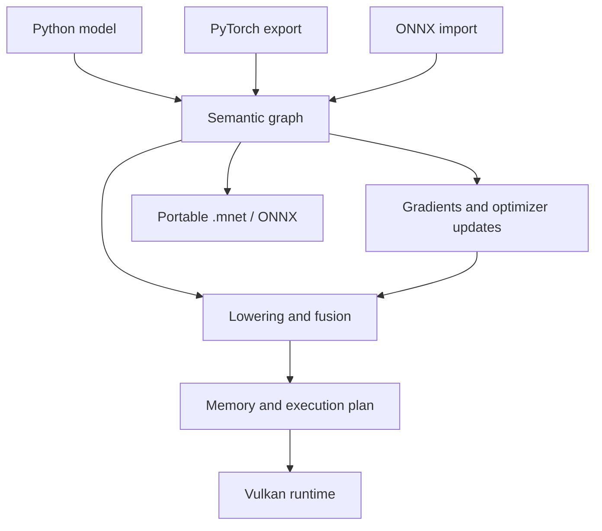

# MuNet: architecture and implementation boundaries

Design and reference review: 7 September 2026.

## Recommendation

Build a small C++ graph compiler and runtime, with Python as the model-authoring interface. Make a complete training step the unit of compilation. Model state, activations, gradients, and optimizer state belong to the device execution plan. A portable semantic graph is the source of truth for execution and model interchange.

Vulkan is the sole accelerator API. Maintain an explicit CPU backend as a numerical reference and debugging tool. The production GPU path must report unsupported operations before execution instead of silently moving tensors to the CPU.

The 0.2 implementation retains the `munet-nn` package identity and `munet_nn` import, with installable node/server commands and a CMake SDK; see [installation and releases](install.md). It proves this arrangement on a small dense network. It does not implement RT-DETR or establish competitive performance on physical GPUs.

## Lessons from the reference project

Reviewed source: [MuNet at commit 6ff82f9](https://github.com/bryan-pakulski/MuNet/tree/6ff82f9715e626167179a9199cc33eb685e0e044). This was a targeted architecture review, not an exhaustive audit or a diagnosis of why the project failed.

The prior Vulkan backend already has batched command submission, multiple in-flight frames, and staging transfers. Retain that concern for submission overhead. Its `mean_last_dim` implementation nevertheless copies to a CPU implementation and back; some immediate paths call `vkQueueWaitIdle`. These are concrete places where the desired resident execution contract breaks. Shader source is compiled through a `glslc` subprocess. [Vulkan implementation](https://github.com/bryan-pakulski/MuNet/blob/6ff82f9715e626167179a9199cc33eb685e0e044/src/backend/vulkan_backend.cpp).

The ONNX helper contains a native sequential conversion route and a broader graph interpreter. Saving through the native deployable route is limited to models that lower to the supported native module representation. General graph execution also contains NumPy conversion helpers. The new project should give branches, shared values, shapes, parameters, and serialization the same graph representation from the beginning. [ONNX integration](https://github.com/bryan-pakulski/MuNet/blob/6ff82f9715e626167179a9199cc33eb685e0e044/python/munet_nn/_helpers/onnx_integration.py).

The architectural change is therefore graph-level ownership of differentiation, scheduling, and interchange. A larger catalogue of independent shader wrappers would not, by itself, establish that ownership.

## Compilation pipeline

The semantic graph preserves dtype, logical shape, operator attributes, parameter identity, output names, and state updates. Views need explicit shape/stride/alias semantics as support expands. Avoid treating physical packing, shader variants, or driver pipeline objects as the model definition.

Automatic differentiation produces another graph. Forward values needed by backward must remain live or be deliberately recomputed. Optimizer updates follow gradient computation and must not overwrite values still needed by another gradient. The prototype snapshots all update results before applying parameter writes.

Lowering selects kernel families. Fuse compatible pointwise operations and producer/consumer epilogues where doing so reduces memory traffic. Keep matrix multiplication, reductions, convolutions, and attention at useful scheduling boundaries. One giant shader can worsen register pressure and occupancy; fusion must eventually have a cost model.

Compilation should be cached by semantic graph, shapes, layouts, dtype/precision policy, compiler revision/options, capability profile, and selected kernel variants. A driver pipeline cache additionally needs device/driver compatibility, including the Vulkan pipeline cache UUID. Portable SPIR-V and driver-specific pipelines are different cache layers.

The current prototype implements static shape inference, reverse-mode rules, dead-code elimination, single-consumer expression fusion, liveness-based buffer reuse, GLSL generation, SPIR-V disk caching, and per-plan pipeline/command-buffer reuse. It does not yet implement a cost model, automatic differentiation of arbitrary custom kernels, dynamic specialization caches, or persistent driver pipeline caches.

## Portability is a capability contract

Use a baseline that is small enough to serve mobile and embedded devices, and explicitly query faster features. The prototype requests Vulkan 1.1 and uses float32 storage-buffer compute. It checks the selected device's API version, compute queue, workgroup limits, storage-buffer range, and required memory types.

| Target | Intended path | What must be verified on the actual device |
|---|---|---|
| NVIDIA / AMD / Intel desktop | Native Vulkan compute | Driver correctness, subgroup properties, matrix features, memory budget, kernel performance |
| Android Adreno / Mali | Native Vulkan compute | Android device/driver support, shared-memory limits, precision, thermal behavior |
| macOS / iOS | MoltenVK over Metal | Portability enumeration/subset, available compute features, packaging, allocation limits |
| Raspberry Pi 4 / 5 | Mesa V3DV | Installed driver version and capabilities, memory capacity, thermal limits, viable model size |

Apple support uses a translation implementation rather than a native Apple Vulkan driver; query the advertised portability subset. Raspberry Pi 5 specifications advertise Vulkan 1.3, but board capability and the installed software stack must both be checked. Older Raspberry Pi models are not automatically included. [Khronos portability guide](https://docs.vulkan.org/guide/latest/portability_initiative.html), [Raspberry Pi 5 specifications](https://www.raspberrypi.com/products/raspberry-pi-5/).

Optional profiles should add FP16 storage and arithmetic, subgroup reductions, timeline semaphores, synchronization2, and cooperative matrices independently. Storage support does not imply the same arithmetic support. Cooperative-matrix types, dimensions, accumulation types, and scopes must be enumerated; extension presence alone is insufficient to select a tile. [Khronos cooperative matrix specification](https://docs.vulkan.org/refpages/latest/refpages/source/VK_KHR_cooperative_matrix.html).

Only compute hardware exposed through Vulkan is in scope. Vulkan does not promise access to every vendor accelerator or NPU. The same model graph can be portable without providing identical throughput or fitting in memory on every device. Full RT-DETR training on a Raspberry Pi is not an acceptance promise; supported inference and appropriately small training workloads are.

## GPU memory and scheduling

Use persistent parameter/optimizer allocations and a planned temporary arena. Track aliases and last consumers across both forward and backward. Include state writes and outputs in lifetime analysis. A buffer can be recycled only after its consumers and any in-flight execution have finished.

On discrete GPUs, allocate device-local memory and use reusable host staging rings for batches/results. On unified-memory hardware, choose memory types from measured access patterns instead of assuming a mapped allocation is fastest. The host should prepare input batches and submit work; tensor data should cross back only for requested results, diagnostics, checkpoints, or explicit interop.

The initial executor records input copies, dispatches, barriers, and parameter-update copies once. It submits one command buffer per invocation. It waits for the previous replay before reusing its staging/output storage, so it supports one in-flight step. This is a correctness foundation, not the final asynchronous scheduler.

The next runtime iteration needs bounded staging rings, asynchronous result objects, timeline-based reclamation where supported, arena splitting/suballocation, and overlap of data preparation/transfer with compute. The current full-arena staging mirror and single storage-buffer range are unsuitable for large models. Activation checkpointing, gradient accumulation, and explicit memory budgets should precede ambitious device offloading.

An all-device-resident training step also needs matching and optimizer logic to remain on the device. RT-DETR's CPU Hungarian matcher is an explicit early integration exception; it must be measured and visible, and eventually removed to meet that final contract.

## Kernel strategy

Start with float32 numerical correctness. Introduce tuned kernels in measured order: tiled GEMM and epilogues, convolution forward/backward, reductions and normalization, attention, sampling and scatter accumulation, then optimizer fusion.

For mixed precision, preserve float32 accumulations and master weights where necessary, add non-finite gradient detection and loss scaling, and make precision policy part of the compile key. Test small detection logits and box losses for numerical stability; average throughput is not the only objective.

Autotuning must be bounded and cached. Candidate tiles need capability and resource checks before compilation. Record cold compile time, warm latency, peak memory, and numerical tolerance. Tuning results belong to a device/driver/profile and should be invalidated when those change.

The prototype uses generated GLSL and `glslangValidator`. Compiler subprocesses occur only on cache misses, outside replay. A production distribution should use an in-process compiler such as shaderc, or evaluate Slang for a maintainable kernel language and custom-kernel differentiation. Slang's automatic differentiation can help generate kernel derivatives; it does not replace tensor-graph differentiation, state semantics, or a memory planner. [Slang differentiation documentation](https://shader-slang.org/slang/user-guide/autodiff).

Before making the compiler more sophisticated, benchmark a fixed RT-DETR subgraph against IREE's Vulkan path. IREE already supplies a C/C++ runtime and an MLIR-based compiler with PyTorch integration. Its larger compiler stack and current Vulkan baseline are tradeoffs against the desired compact, broadly compatible stack. Keep it as a concrete comparison, not an extra mandatory backend. ncnn is another useful inference/kernel reference, but it does not supply the requested general training system. [IREE Vulkan deployment](https://iree.dev/guides/deployment-configurations/gpu-vulkan/), [IREE PyTorch integration](https://iree.dev/guides/ml-frameworks/pytorch/), [ncnn](https://github.com/Tencent/ncnn).

## Python and PyTorch compatibility

Expose familiar model composition, parameters, losses, optimizers, gradient control, and state dictionaries. The initial training example retains `zero_grad()`, `loss.backward()`, and `optimizer.step()` inside a compiled function. That is an API resemblance, not full PyTorch compatibility.

The next authoring layer should add eager execution sharing the same op registry, explicit train/eval state, non-trainable buffers, no-grad/detach, stable parameter naming, and useful operator-specific diagnostics. Capture only supported static Python control flow; never silently freeze data-dependent conditions.

Treat PyTorch interoperability as three separate deliverables:

| Route | Initial implementation | Later scope |
|---|---|---|
| State dictionaries | Matching native layers can load PyTorch tensors through explicit CPU copies | Validated checkpoint mapping for RT-DETR, tied parameters and buffers |
| Model graph import | Eval model → modern PyTorch ONNX exporter → native graph for the supported subset | Direct `torch.export` normalized graph lowering with metadata and training semantics |
| Runtime tensor interchange | Explicit NumPy/CPU transfers | Capability-checked external-memory interop; never assume a CUDA pointer is a Vulkan allocation |

`torch.export` captures tensor computation and shape constraints; it is not a mechanism for preserving arbitrary Python behavior. A future `torch.compile` backend can be a convenience interface, but it should not become the only way native MuNet models train. [PyTorch export documentation](https://docs.pytorch.org/docs/stable/user_guide/torch_compiler/export.html), [PyTorch ONNX exporter](https://docs.pytorch.org/docs/stable/onnx.html).

## Native format and ONNX

Keep `.mnet` device-independent: versioned semantic graph, tensor records, entry points, shape/dtype contracts, parameter/state identity, and optional training state. Place compiled deployment bundles in a separate versioned layer with target-feature requirements and rebuild/fallback rules.

The prototype archive uses a JSON manifest and little-endian float32 NPY tensor records in a ZIP container. It contains no Python pickle or embedded executable code. The reader checks format version, entry names, byte limits, tensor headers, topology, inferred shapes, and input mappings. This is an experimental format, not a stable long-term ABI.

ONNX import and export must share semantic operator definitions with native construction. Validate operator versions and attributes, not just operator names. Unsupported conversions should provide the failing node, operator, shape, and reason. Export standard decompositions when they are equivalent; never substitute an identity or silently switch to ONNX Runtime.

ONNX itself includes training-related representations. However, an ordinary exported inference graph generally does not recover the original optimizer, random state, Python training loop, detached paths, or unfused training-time normalization. Importing that graph is not enough to reproduce training. Our v0 converter intentionally supports inference interchange and rejects ONNX training metadata. [ONNX IR specification](https://onnx.ai/onnx/repo-docs/IR.html).

Round-trip acceptance means supported outputs agree numerically, including shapes/dtypes and weights. It does not require byte-identical files or an identical operator graph after decomposition.

## Multiple devices

Each compiled plan selects one physical device. The 0.2.0 training swarm runs independent C++ replicas across nodes and aggregates their gradients through an authoritative owner. It implements leased chunks, capability reports, offline cached execution, durable result delivery, epoch coverage and atomic checkpoint advancement for small deterministic MSE/SGD jobs. See [the swarm design and protocol](swarm.md). It does not combine memory across devices or implement fast GPU collectives.

Keep one-device RT-DETR correctness as the prerequisite for its distributed acceptance. Its losses need global normalization rules, and BatchNorm needs an explicit distributed policy. Later add gradient buckets, collective operations, and overlapped transfers. Heterogeneous Vulkan devices are not guaranteed to support peer memory or a common device group. The current swarm uses explicit host staging and full-gradient/checkpoint traffic; bandwidth and owner aggregation must be measured before claiming scaling. Define reduction precision and synchronization semantics before adding automatic placement or offloading.

Cross-device collectives are a separate scope from running the same graph on different vendors. Neither should silently inherit CUDA/NCCL as a required dependency.

## Release definition

RT-DETR is a strong vertical acceptance target because it exercises convolution, normalization, attention, sampling, indexing, losses, matching, autodiff, and optimizer state. Passing it would not establish complete coverage of every deep-learning workload, but it would validate the central design far more effectively than disconnected operator demos.

The next implementation priority is convolution/normalization plus a standalone deformable-attention forward/backward test. Keep a machine-readable operator coverage matrix and block unsupported models before execution. Add platform claims only after running that matrix and representative inference/training workloads on the named hardware.
