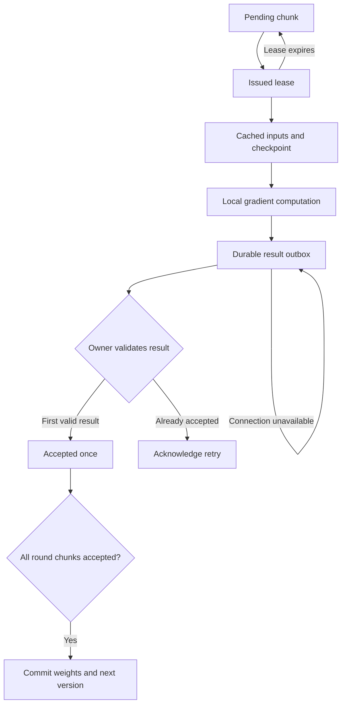

# Training swarm: owner and native nodes

Implemented in MuNet Next 0.2.0. The initial swarm trains deterministic, sample-independent dense models with mean squared error and SGD. It runs the existing C++ forward/backward graph on each node, using Vulkan or the explicitly selected CPU reference backend. RT-DETR and its distributed loss/normalization semantics remain future work.

## Training semantics

The owner is the sole authority for weights, optimizer updates, sample coverage, and epoch completion. Each node holds a full model replica. The dataset is deterministically shuffled once per epoch and divided into fixed global batches. A global batch is one training round and one optimizer update, independent of how many workers happen to connect. Each round is divided into microbatch chunks, all based on the same immutable checkpoint.

For chunk `i` containing `n_i` samples, the node returns a mean loss and mean parameter gradient `g_i`. The owner waits for every chunk, accumulates results in manifest order, and computes:

\[
g = \frac{\sum_i n_i g_i}{\sum_i n_i},\qquad
\theta_{v+1}=\theta_v-\eta g.
\]

This preserves the selected global-batch SGD algorithm up to floating-point differences, including uneven final chunks. Owner reduction uses float64 accumulation, then a float32 gradient and float32 SGD update. The principle is data-parallel training: replicas process different samples and combine gradients before stepping. [PyTorch distributed training overview](https://docs.pytorch.org/tutorials/beginner/dist_overview.html).

**Nodes do not run independent optimizer steps in this mode.** A disconnected node can complete already downloaded work from its assigned round. It cannot keep producing useful future rounds indefinitely without updated weights. Once all available copies of a chunk disappear, that round waits for a capable node to finish a retry. Joining or losing workers changes scheduling, not the global batch size, learning rate, or sample coverage.

Local-SGD/FedAvg is a separate planned mode for longer offline intervals: workers perform multiple local updates and later merge model deltas. It changes the optimization algorithm and needs its own treatment of data partitioning, weighting, drift, staleness, and convergence. It must not be presented as equivalent to arbitrary single-owner SGD. [McMahan et al., Communication-Efficient Learning of Deep Networks from Decentralized Data](https://arxiv.org/abs/1602.05629).

## A chunk's lifetime



Work may be computed more than once; a chunk contributes at most once. An expired attempt is still allowed to win while its chunk is uncommitted and its checkpoint is current. A replacement lease does not invalidate already useful computation. The first valid result wins; other issued attempts are acknowledged as already completed. A repeated accepted attempt must carry an identical payload. Unknown attempts and incompatible job, program, data, parameter shape, sample count, or checkpoint identities are rejected. Non-finite results are rejected.

Leases use owner time. Nodes do not need synchronized clocks. The worker renews leases between prefetch and execution; the HTTP API also supports explicit heartbeats. The current binary does not send background heartbeats during a long kernel. Such work can be retried after expiry, with duplicate suppression preserving correctness. Lease duration should cover a normal bundle's download and computation time, and owner wall-clock jumps can cause early retries or delayed reassignment.

## Durable owner

`python -m munet.swarm JOB_DIRECTORY` runs a small Python control plane using the standard HTTP server and SQLite, plus NumPy for gradient aggregation/SGD. Numerical worker execution remains C++. There is no Redis, message broker, PyTorch execution engine, or mandatory distributed framework.

The job directory contains:

| Item | Purpose |
|---|---|
| `job.json` | Immutable job identity, sample manifest, round structure, learning rate and profile references |
| `artifacts/` | SHA-256 addressed programs, data chunks, checkpoints and accepted results |
| `owner.sqlite`, WAL and SHM | Workers, leases, accepted chunk pointers, round commits and current checkpoint |
| `owner.lock` | Exclusive process lock for one owner |

The owner serializes writes with SQLite transactions in WAL mode and `synchronous=FULL`. Artifacts are atomically renamed and fsynced before the journal may reference them. Acceptance of the last chunk, the SGD update, its new checkpoint pointer, and advancement to the next round share one transaction. A crash before commit leaves the previous checkpoint authoritative; a crash afterward makes retries idempotent. Orphan artifacts left by a failed transaction are harmless and currently retained.

Restart using the same directory and configuration. Existing leases and completed chunks survive. Never start independent owners from copied journals for the same live job. A local process lock prevents two owners opening this directory; distributed owner failover, consensus, and split-brain fencing are not implemented. Keep the owner state on a reliable local filesystem. Stop the owner before copying its full job directory for a simple consistent backup, or use a proper SQLite backup/snapshot procedure.

An epoch is complete only when all its rounds are committed and all original samples have contributed exactly once. `GET /v1/status` exposes the checkpoint version, accepted sample count, completed epochs, per-round losses, last-seen worker timestamps, and throughput estimates. There is no fixed world size or persistent worker connection.

## Native node

`munet-node` is a C++17 executable. It links the MuNet runtime, libcurl and OpenSSL. Its JSON parser is vendored nlohmann/json 3.11.3 under its included MIT license. A Vulkan build additionally requires the Vulkan loader and a working device driver. Python, PyTorch, NumPy, ONNX, and a shader compiler are not needed on nodes.

The owner compiles portable SPIR-V when preparing a Vulkan job. Nodes reconstruct the native graph/plan, validate generated-source hashes and arena size against the program, and let the Vulkan driver compile device pipelines. The same resident execution plan is reused while the profile is unchanged. Parameters stay on the device across chunks of the same round; the next checkpoint explicitly updates them. One profile is kept resident at a time to bound device allocations. Plans/pipelines are recreated after a node process restart.

Each node advertises runtime ABI, backend, device name, float32 support, storage-buffer limit, memory budget, maximum microbatch, host memory and logical thread count. Vulkan heap capacity is a capacity query, not a measurement of currently free memory. `--memory-mib` allows a conservative operator budget. Initial throughput can be supplied with `--samples-per-second`; otherwise a node starts with one chunk and self-reports measured samples/second after real work. This estimate is persisted locally. The owner maintains a throughput EWMA and sizes later bundles toward `--target-seconds`, capped by `--max-bundle`. It assigns only profiles that fit the advertised arena and staging budget and batch limit.

These are scheduling hints, not performance guarantees. Shared GPU memory, host JSON/graph allocations, other applications, and thermal limits can still prevent execution. A failed assignment is retained locally; the owner retries it after lease expiry. Automatic OOM-driven profile changes, per-worker quarantine/backoff, fair-share scheduling, bandwidth-aware tuning, and dynamic microbatch compilation are future work. Choose a microbatch that fits the smallest intended worker. A node must fit the **whole model plus its microbatch**; the swarm does not combine node memory or shard one model.

The node state directory contains its persistent identity, verified artifact cache, pending assignments, result outbox, and retained failed/rejected records. Data and programs download with HTTP Range support into `.part` files and are verified by SHA-256 before use. Cached work executes even when the owner is offline. Results are written and fsynced before upload, and removed only after acceptance or duplicate acknowledgement. Restart with the same node state directory and owner URL to continue. Each process needs its own state directory; a file lock prevents accidental sharing.

## Build and run

The implemented owner and node durability layer currently target Linux/POSIX. Release CI targets Linux x86-64 and aarch64 packages; physical ARM devices, other operating systems and mobile deployment still need validation or ports. See [installation and releases](install.md) for pip commands and standalone binaries. Build the worker for each target architecture; one binary does not run on every operating system/CPU.

On a Linux build machine:

```bash
sudo apt-get install build-essential cmake libvulkan-dev glslang-tools libcurl4-openssl-dev libssl-dev
python -m pip install .

# The node build has no Python build dependency.
cmake -S . -B build-node -DMUNET_PYTHON=OFF -DMUNET_SWARM_NODE=ON -DCMAKE_BUILD_TYPE=Release
cmake --build build-node -j

python examples/swarm_mlp.py prepare demo-job --epochs 10
```

For CPU reference work, also set `-DMUNET_VULKAN=OFF` on the worker build, prepare with `--cpu-only`, and select `--device cpu`. A CPU-only MuNet Python installation can prepare Vulkan jobs if `glslangValidator` is available: only the nodes need a Vulkan runtime for execution.

Set the same secret of at least 32 characters as `MUNET_SWARM_TOKEN` on the owner and authorized workers. Use a securely supplied environment variable; do not put it in a URL or command-line argument. For example, generate a value once with `python -c 'import secrets; print(secrets.token_urlsafe(32))'` and distribute it through your normal secret configuration.

Start the owner and nodes in separate terminals:

```bash
# Owner: defaults to loopback.
python -m munet.swarm demo-job --port 8765

# Node A
./build-node/munet-node --owner http://127.0.0.1:8765 --device vulkan:0 --state node-a

# Node B: another device on this host, or a separate machine pointed at the owner.
./build-node/munet-node --owner http://127.0.0.1:8765 --device vulkan:1 --state node-b
```

Use a device index actually present on each host. A CPU reference worker can join the same Vulkan-enabled job with `--device cpu`.

For remote connections, serve HTTPS directly with `--bind 0.0.0.0 --cert server.crt --key server.key`, or use a properly configured HTTPS reverse proxy to a loopback owner. libcurl verifies server certificates and hostnames, and does not forward credentials through redirects. Set `MUNET_CA_BUNDLE` to supply a private CA bundle; otherwise the node uses the host trust store. A private tunnel/network may use explicit `--allow-http` on both non-loopback endpoints. Plaintext does not protect tokens or model/data contents on its own.

Authorized nodes are trusted with model weights, assigned data and computation. The shared token is admission control, not per-node attestation. Result validation prevents malformed/duplicate updates; it cannot prove a malicious worker computed an honest gradient. Public anonymous workers, Byzantine verification, per-worker credentials/revocation, privacy-preserving aggregation and production ingress hardening are outside this prototype.

After training, stop the owner and export its checkpoint:

```bash
python -m munet.swarm demo-job --status
python examples/swarm_mlp.py export demo-job --output trained.mnet --onnx
```

The resulting inference graph uses the existing `.mnet` and ONNX converters. Swarm job/journal files are a separate experimental format, not an ONNX training archive. You can load the latest weights into your own native model with `Owner.load_into(model)` and then use the usual `mu.compile`, `mu.save`, and ONNX export flow.

## API for custom models

```python
from munet.swarm import create_job

create_job(
    model, x, target, "my-job",  # finite float32 arrays [samples, ...]
    global_batch_size=32,       # defines optimizer semantics
    micro_batch_size=4,         # smallest scheduling/memory unit
    epochs=10, lr=0.03, seed=42,
    include_vulkan=True,
)
```

The prototype fixes the loss to MSE with exactly matching prediction/target shapes and SGD without momentum. The caller must supply a deterministic model whose outputs are independent across samples. Batch-coupled operations in a custom `forward`, even if traceable, violate this contract. Detection losses with variable object counts need explicit global numerator/denominator handling, while BatchNorm needs an explicit frozen/local/synchronized policy. Merely adding RT-DETR's operators will not settle those swarm semantics.

## Protocol and current bounds

| Endpoint | Function |
|---|---|
| `POST /v1/register` | Stable worker identity and capability report |
| `POST /v1/lease` | Lease a same-checkpoint bundle or report waiting/completed |
| `POST /v1/heartbeat` | Renew live, uncompleted issued attempts |
| `POST /v1/results` | Validate and durably accept/acknowledge a mean gradient result |
| `GET /v1/artifacts/{sha256}` | Immutable, authenticated, resumable artifact download |
| `GET /v1/status` | Durable progress and scheduling observations |

Every endpoint requires bearer authentication. Protocol ABI is `munet-swarm-1`; program code generation must match between owner and node. Dtype is float32. A job is limited to 100,000 parameter values; artifacts to 256 MiB each; result uploads to 32 MiB. These conservative limits keep the JSON-based transport a usable small-model prototype. Dataset chunks and all epoch manifests are materialized ahead of time, and cached artifacts/results are not automatically garbage-collected. The scheduler, database, full-gradient traffic, and owner CPU aggregation have not been benchmarked at scale.

Forward/backward computation remains on the selected device. Returning gradients to the owner and distributing checkpoints necessarily uses explicit host staging/network transfers in this implementation. It does not preserve the single-device prototype's zero-gradient-readback replay behavior across the network. Large-model WAN training needs binary tensor streaming, resumable uploads, compression/bucketing, overlapping transfers, bounded retention, efficient optimizer state, and measured owner bottlenecks. Same-site fast collectives and occasional-connectivity local-SGD should be distinct scheduling/algorithm options over the same compiler/runtime.

## Validation

The suite covers analytical SGD equivalence and exact sample coverage, native two-node MLP training against PyTorch with uneven chunks, mixed CPU/software-Vulkan workers contributing to the same rounds, capability filtering, lease renewal, expired-attempt races, concurrent duplicate delivery, malformed/incompatible results, an injected crash before optimizer commit, actual node process termination, offline native computation, durable outbox replay, owner restarts, lost acknowledgements, authentication, and resumed downloads. See [the validation report](validation.md) for the executed results and limits.

Build with `python tools/build.py --cmake-arg=-DMUNET_SWARM_NODE=ON`, then run `PYTHONPATH=python python tools/test.py --vulkan-validation --swarm`. Set `MUNET_SWARM_NODE` to an alternate worker executable. The `--swarm` gate fails if that binary is missing. Remote WAN behavior, physical heterogeneous GPUs, TLS deployment, throughput scaling and training quality beyond the small deterministic MLP remain unvalidated.
